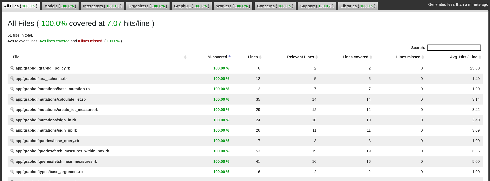
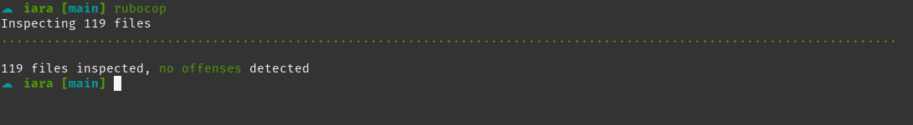

# 🧜🏽‍♀️ Iara

Este projeto, apelidado de **Iara** (segundo o folclore brasileiro, sereia que vive no rio Amazonas), busca auxiliar na proteção de lagos e represas, provendo o cálculo de indicadores de qualidade da água, a princípio, o **Índice do Estado Trófico (IET).**

# Índice do Estado Trófico

A eutrofização é o aumento da concentração de nutrientes, especialmente fósforo e nitrogênio, nos ecossistemas aquáticos, produzindo um aumento da população de algas dos mesmos. São vários os efeitos indesejáveis da eutrofização, entre eles: maus odores e mortandade de peixes, mudanças na biodiversidade aquática, entre outros. ([Saiba mais](http://pnqa.ana.gov.br/indicadores-estado-trofico.aspx))


# Tecnologias

* API: **Ruby on Rails** (modelo **GraphQL**)
* Banco de dados: **PostgreSQL** + **PostGIS** (processamento de coordenadas geográficas)
* Framework testes: **RSpec**

## Cobertura de Testes



## Suite de Testes


## Lint de arquivos



# Configuração do ambiente de desenvolvimento

## Requisitos

1. **ruby** v3.0.2
2. gem **bundler** v2.2.22
3. lib linux **postgresql-client**
4. **docker** v20.10.10 e **docker-compose** v1.29.2


## Passo a passo

1. Preencha o arquivo **.env** (use como modelo o arquivo **.env.template**) com as credenciais do banco de dados.

2. Inicie o container do banco de dados:

```bash
docker-compose up --detach
```

3. Baixe as dependências do projeto:

```bash
bundle install
```

4. Crie e atualize o banco de dados:

```bash
rails db:create db:migrate
```

5. Caso queira popular o banco de dados com alguns registros:

```bash
rails db:seed
```

6. Inicie o servidor (por padrão, na porta 3000):

```bash
rails server
```

7. Utilize o Insomnia (ou ferramenta semelhante), para fazer requisições. O arquivo a seguir, pode ser importado no Insomnia (ele contém exemplos das requisições que podem ser realizadas):

[Acessar Arquivo de Coleções](guides/requests/insomnia-requests.json)

Defina um alias para a API no Insomnia:

```json
{
  "baseUrl": "http://localhost:3000/graphql"
}
```
